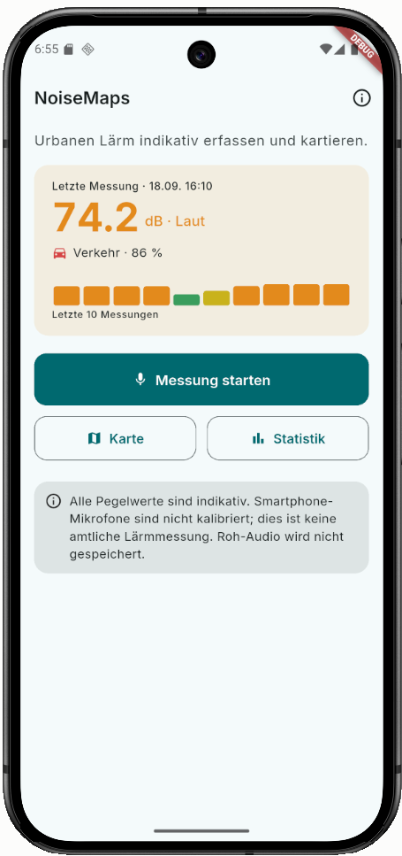
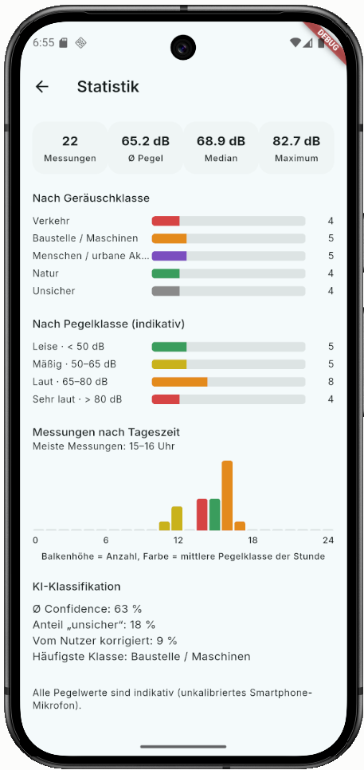
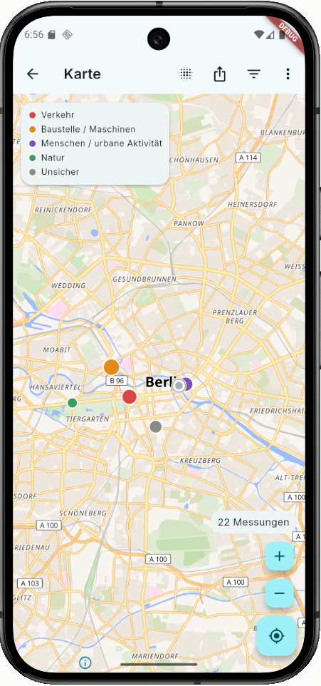
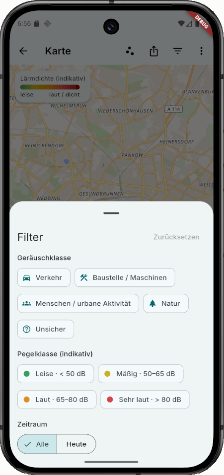
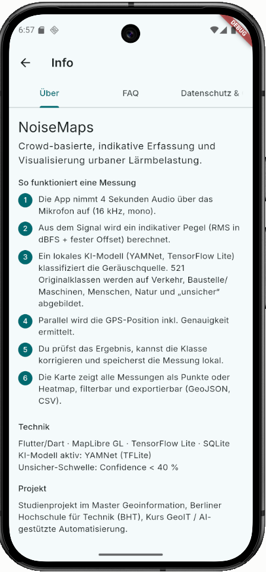

# NoiseMaps

Mobile GeoIT-App zur crowd-basierten, **indikativen** Erfassung und Visualisierung urbaner Lärmbelastung.

Studienprojekt im Master Geoinformation, BHT Berlin – Kurs GeoIT / Automatisierte Geodatenprozessierung (Prof. Wagner).

**Name:** Paul Timon Stolpmann
**Matrikelnummer:** 110129

**Quellcode:** https://github.com/pstolpm/NoiseMaps
**Ausführbarer Code (Release-APK):** https://github.com/pstolpm/NoiseMaps/releases/download/v1.0/app-release.apk (Installationsanleitung siehe [INSTALLATION.md](INSTALLATION.md))

> Nur die fertige App ausprobieren, ohne Entwicklungsumgebung? Siehe [INSTALLATION.md](INSTALLATION.md).
> Kurzer technischer Überblick (Architektur, Datenfluss, KI-Modell)? Siehe [TECHNICAL_OVERVIEW.md](TECHNICAL_OVERVIEW.md).

## Was die App tut

1. nimmt für wenige Sekunden Audio über das Smartphone-Mikrofon auf,
2. berechnet daraus einen indikativen Geräuschpegel,
3. klassifiziert die Geräuschquelle mit einem lokalen KI-Modell (Verkehr, Baustelle/Maschinen, Menschen, Natur, unsicher),
4. verortet die Messung per GPS,
5. speichert Messung und KI-Ergebnis lokal auf dem Gerät,
6. zeigt Messpunkte auf einer MapLibre-Karte (Punkte oder Heatmap, filterbar),
7. erlaubt den Export von Messungen als GeoJSON/CSV/PNG sowie den Import fremder GeoJSON-Dateien als offline-basierte Crowd-Daten.

**Wichtiger Hinweis:** NoiseMaps ist **keine amtliche Schallpegelmessung**. Smartphone-Mikrofone sind nicht kalibriert; alle Pegelwerte sind indikativ. Roh-Audio wird nach der Auswertung verworfen und nicht gespeichert.

## Funktionsumfang

- **Messung**: Mikrofon- und Standortberechtigung, 3–5 Sekunden Aufnahme, Live-Pegelanzeige
- **KI-Klassifikation**: YAMNet (TensorFlow Lite, on-device), Mapping auf 5 Zielklassen, Confidence-Anzeige, bei niedriger Confidence automatisch „unsicher", Nutzerkorrektur möglich, Detailansicht der KI-Rohklassen
- **Persistenz**: lokale SQLite-Datenbank, Messungen bleiben über Neustarts erhalten
- **Karte**: MapLibre GL, Messpunkte oder Heatmap, Legende, Filter (Kategorie, Pegelklasse, Zeitraum), Zoom-Buttons, „zu meinem Standort"
- **Statistik**: Kennzahlen, Verteilung nach Kategorie/Pegel, Tagesverlauf
- **Export/Import**: GeoJSON, CSV und PNG-Export über den nativen Teilen-Dialog; GeoJSON-Import zur offline-Zusammenführung von Messungen mehrerer Geräte (Crowd-Daten), inkl. Duplikaterkennung und visueller Kennzeichnung importierter Punkte
- **Design**: eigenes petrolfarbenes Theme, Inter-Schriftart, eigenes App-Icon
- **Info/FAQ/Datenschutz**: eigener Infobereich in der App

Der komplette Funktionsumfang der „Definition of Done" (siehe Projektunterlagen) ist umgesetzt und auf einem Android-Emulator getestet, inklusive Installation der Release-APK auf einem zweiten Gerät.

## Entwicklung

Voraussetzungen: Flutter (stable), Android SDK inkl. NDK 28.2.13676358, ein Android-Emulator oder physisches Gerät (min. Android 8.0 / API 26).

Das KI-Modell `yamnet.tflite` muss vor dem ersten Build unter `assets/models/yamnet.tflite` liegen (siehe [TECHNICAL_OVERVIEW.md](TECHNICAL_OVERVIEW.md) für die Quelle).

```bash
flutter pub get
flutter run
```

Tests:

```bash
flutter analyze
flutter test
```

Release-APK bauen:

```bash
flutter build apk --release
```

Ergebnis: `build/app/outputs/flutter-apk/app-release.apk`

## Projektstruktur

```
lib/
  core/           Konstanten, Theme, Utilities
  models/         Datenmodelle (NoiseMeasurement, NoiseCategory, Filter, Statistik)
  services/       LocationService, AudioService, SoundLevelService,
                   AiClassificationService, ExportService – jeweils als
                   austauschbares Interface mit echter und Fake/Mock-Implementierung
  repositories/    MeasurementRepository (SQLite- und In-Memory-Implementierung)
  screens/        Home, Messung, Ergebnis, Karte, Statistik, Info/FAQ
  widgets/        wiederverwendbare UI-Bausteine
assets/
  models/         yamnet.tflite (KI-Modell, siehe TECHNICAL_OVERVIEW.md)
  labels/         Klassen-Mapping YAMNet -> Zielkategorien
  fonts/          Inter (SIL OFL 1.1)
  icon/           App-Icon-Quelldateien
test/             Unit- und Widget-Tests
```

Die zentrale Architekturentscheidung: Alle Kernfunktionen (Standort, Audio, KI, Speicherung) laufen hinter abstrakten Service-Interfaces. Dadurch lässt sich z. B. die KI-Komponente unabhängig von der restlichen App austauschen oder testen (Mock-Implementierungen werden in den Tests verwendet).

## Datenschutz

- kein dauerhaftes Speichern von Roh-Audio
- KI-Inferenz läuft vollständig lokal auf dem Gerät
- keine Nutzerkonten, keine Geräte-ID, keine personenbezogenen Bewegungsprofile
- Crowd-Daten werden ausschließlich über manuellen, lokalen Dateiaustausch (GeoJSON-Export/Import) zusammengeführt, nicht über einen Server
- Datenschutzhinweise sind direkt in der App abrufbar (Info-Bereich)

## Screenshots

| Home | Messung / Ergebnis (Statistik) | Karte (Punkte) |
|---|---|---|
|  |  |  |

| Karte (Heatmap + Filter) | Info / FAQ |
|---|---|
|  |  |

## Lizenzen & Quellen

- **KI-Modell**: [YAMNet](https://www.kaggle.com/models/google/yamnet) (Audioklassifikation, TensorFlow Lite), Teil von [tensorflow/models](https://github.com/tensorflow/models), lizenziert unter der [Apache License 2.0](https://github.com/tensorflow/models/blob/master/LICENSE)
- **Kartenstil/Tiles**: [OpenFreeMap](https://openfreemap.org) („Liberty"-Stil), Kartendaten: [© OpenStreetMap-Mitwirkende](https://www.openstreetmap.org/copyright), lizenziert unter der [Open Database License (ODbL)](https://opendatacommons.org/licenses/odbl/)
- **Kartenbibliothek**: [MapLibre GL](https://maplibre.org/)
- **Schriftart**: [Inter](https://rsms.me/inter/), lizenziert unter der [SIL Open Font License 1.1](https://rsms.me/inter/) (siehe `assets/fonts/LICENSE-Inter-OFL.txt`)
- Alle weiteren verwendeten Flutter-Pakete und ihre jeweiligen Lizenzen sind in `pubspec.yaml` bzw. auf [pub.dev](https://pub.dev) einsehbar.

