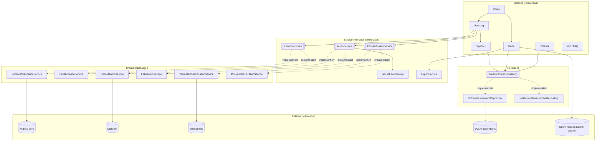
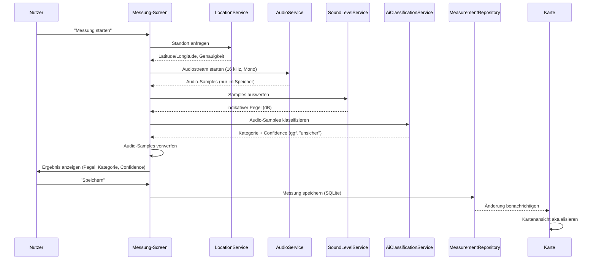

# NoiseMaps – Technische Kurzbeschreibung

## Zweck

NoiseMaps ist eine mobile GeoIT-Anwendung (Android, Flutter/Dart), die eine indikative, crowd-basierte Erfassung urbaner Lärmbelastung ermöglicht: Nutzer messen an ihrem Standort kurz das Umgebungsgeräusch, eine KI klassifiziert automatisch die vermutliche Geräuschquelle, und alle Messungen werden auf einer Karte dargestellt.

## Automatisierte Prozesskette

1. Nutzer startet eine Messung in der App
2. App prüft Mikrofon- und Standortberechtigung
3. Audio wird ca. 3–5 Sekunden über das Mikrofon aufgenommen (16 kHz Mono, PCM, nur im Arbeitsspeicher – keine Datei)
4. aus dem Signal wird ein indikativer Pegel berechnet (RMS/Peak in dBFS, kalibrierter Offset)
5. das Audiosignal wird an ein lokales TensorFlow-Lite-Modell (YAMNet) übergeben
6. das Modell liefert eine Geräuschklasse und einen Confidence-Wert; die 521 YAMNet-Originalklassen werden auf 5 Zielkategorien abgebildet (Verkehr, Baustelle/Maschinen, Menschen, Natur, unsicher); bei Confidence unter 40 % wird automatisch „unsicher" vergeben
7. GPS-Koordinate und Zeitstempel werden erfasst
8. der Messdatensatz wird lokal in einer SQLite-Datenbank gespeichert
9. die Karte aktualisiert sich automatisch mit dem neuen Messpunkt

Das Rohaudio wird nach Schritt 6 verworfen und nie dauerhaft gespeichert.

## Architektur

Die App ist konsequent hinter austauschbaren Service-Interfaces aufgebaut, sodass sich einzelne Komponenten unabhängig voneinander ändern oder testen lassen:

- `LocationService` (Standortermittlung) – echte Implementierung via `geolocator`, Fake-Implementierung für Tests
- `AudioService` (Audioaufnahme) – echte Implementierung via `record`, Fake-Implementierung für Tests
- `SoundLevelService` (Pegelberechnung aus Audio-Samples)
- `AiClassificationService` (KI-Klassifikation) – echte Implementierung via `tflite_flutter`/YAMNet, Mock-Implementierung für Tests bzw. als Rückfallebene
- `MeasurementRepository` (Persistenz) – SQLite-Implementierung via `sqflite`, In-Memory-Implementierung für Tests

Dieses Muster erlaubt es z. B., die KI-Komponente komplett auszutauschen (anderes Modell, anderer Ansatz), ohne den Rest der App anzufassen.

## Technischer Stack

- Flutter/Dart, Material 3, Android als primäre Zielplattform (min. API 26)
- Karte: MapLibre GL (Vektorkarten, kein API-Key nötig), GeoJSON-Datenquelle, datengetriebene Style-Ausdrücke für Punkt-/Heatmap-Darstellung
- Standort: `geolocator`
- Audio: `record` (PCM-Stream, 16 kHz Mono)
- KI: `tflite_flutter`, Modell YAMNet (on-device Inferenz, kein Server-Aufruf)
- Persistenz: `sqflite` (SQLite)
- Export/Import: `share_plus` (nativer Teilen-Dialog), `file_picker` (Dateiauswahl), eigenes GeoJSON/CSV-Format

## Crowd-Sourcing-Ansatz

Statt einer Cloud-Anbindung (z. B. Firebase) nutzt NoiseMaps einen bewusst einfachen, offline-fähigen Ansatz: Messungen lassen sich als GeoJSON-Datei exportieren und auf einem anderen Gerät importieren. Beim Import werden bereits vorhandene Messungen (per ID) übersprungen, importierte Punkte werden auf der Karte optisch (dunkler Rand) von eigenen Messungen unterschieden. Das erfüllt den Crowd-Gedanken ohne Server, Nutzerkonten oder Internetzwang und ohne dass die App von einer Cloud-Infrastruktur abhängig wird.

## Datenqualität und Einschränkungen

- Smartphone-Mikrofone sind nicht kalibriert – alle Pegelwerte sind **indikativ**, keine amtliche Schallpegelmessung
- niedrige KI-Confidence führt automatisch zur Kategorie „unsicher" statt einer unsicheren Festlegung
- GPS-Genauigkeit wird erfasst und mitgespeichert
- keine Speicherung von Rohaudio, keine Nutzerkonten, keine personenbezogenen Bewegungsprofile

## Nicht umgesetzte, optionale Erweiterungen

- Firebase-Cloud-Synchronisation (bewusst zugunsten des einfacheren, abhängigkeitsfreien GeoJSON-Imports zurückgestellt)
- OSM/Overpass-Kontextanreicherung (z. B. nächstgelegene Straßenklasse) – als mögliche Erweiterung dokumentiert, nicht Teil des MVP

## Architekturdiagramm

Die durchgezogenen Pfeile zeigen den Datenfluss zwischen Screens und Services, die gestrichelten Pfeile die Austauschbarkeit: Jedes Interface (doppelt umrandet) hat eine echte und eine Fake/Mock-Implementierung, sodass sich z. B. die KI-Komponente unabhängig vom Rest der App ersetzen oder in Tests ohne echtes Mikrofon/GPS/Modell ausführen lässt.

## Datenflussdiagramm (eine Messung)

